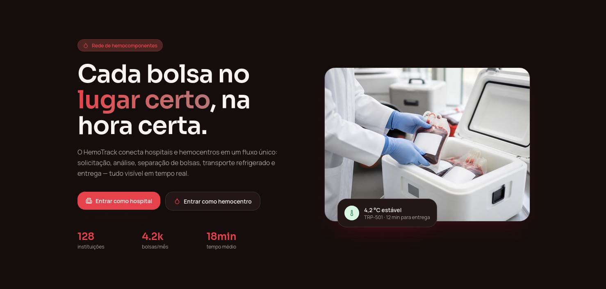

# HemoTrack - Plataforma de Distribuição de Hemocomponentes

> Projeto Integrador de Programação Orientada a Objetos (POO)  
> CESAR School · 3º Semestre · 2026.2


## O que é o HemoTrack?

Uma aplicação web que gerencia e distribui hemocomponentes (bolsas de sangue) entre hemocentros e hospitais. O sistema controla estoque, recebe requisições de hospitais, seleciona bolsas compatíveis (por tipo sanguíneo e validade), calcula rotas de entrega respeitando a cadeia fria, e monitora a temperatura durante o transporte.

## Tecnologias

| Camada | Stack |
|--------|-------|
| **Backend (API)** | Java 17, Spring Boot 3, H2 Database |
| **Frontend (Interface)** | TypeScript, React 18, TanStack Start, Vite, Tailwind CSS |
| **Versionamento** | Git/GitHub |
| **Docs** | Markdown |

## Entregas

### Entrega 01 — 31/08

Histórias de usuário definidas, protótipo Lo-Fi no Figma e screencast publicados. **Concluída.**
- [Protótipo Lo-Fi no Figma](https://www.figma.com/proto/o33X78ZoRifSqpQZyOuI2U/Hemotrack---Prototipo-LOFI?node-id=21-9&p=f&t=jxS6u0a4MgkJWZHt-1&scaling=min-zoom&content-scaling=fixed&page-id=0%3A1&starting-point-node-id=21%3A9)

- [Screencast navegando o protótipo (YouTube)](https://www.youtube.com/watch?v=_Mo2xrN9wh8)

### Entrega 02 — 21/09

Nesta entrega foram desenvolvidas as funcionalidades e os screencasts de criação de requisições e acompanhamento de status pelo hospital, no projeto HemoTrack, incluindo:

#### [Screencast atualizado do sistema (YouTube)](https://www.youtube.com/watch?v=YCow7kq3mf8)
[](https://www.youtube.com/watch?v=YCow7kq3mf8)

* HU03 — Criar requisição de hemocomponentes: o hospital informa componente, tipo sanguíneo, quantidade e prioridade, e o sistema registra a solicitação como "Pendente"
* HU04 — Visualizar e acompanhar requisições: o hospital vê a lista de suas próprias requisições, os detalhes de cada uma, e acompanha a mudança de status (por exemplo, de "Pendente" para "Aceita" quando o hemocentro aprova)

- 📄 [Documento com as histórias](https://github.com/miglitopictures/hemotrack/blob/main/docs/historias.md)


- Issue / Bug tracker:
  


### Entrega 03 — 19/10

Mais 2 histórias implementadas, commits semanais, novos screencasts e issue tracker atualizado.

### Entrega 04 — 09/11

Histórias restantes implementadas, versionamento contínuo, novos screencasts e issue tracker atualizado.


## Como rodar na sua máquina

### Pré-requisitos (instale antes de começar)

#### 1. Git
Pra clonar o repositório.

| SO | Como instalar |
|---|---|
| **Linux (Debian/Ubuntu)** | `sudo apt install git` |
| **Linux (Fedora)** | `sudo dnf install git` |
| **macOS** | `xcode-select --install` ou `brew install git` |
| **Windows** | `winget install Git.Git` ou [git-scm.com](https://git-scm.com) |

Confirme com: `git --version`

#### 2. JDK 17 ou superior
Pra rodar o backend Java.

| SO | Como instalar |
|---|---|
| **Linux (Debian/Ubuntu)** | `sudo apt install openjdk-17-jdk` |
| **Linux (Fedora)** | `sudo dnf install java-17-openjdk-devel` |
| **macOS** | `brew install openjdk@17` (depois `export PATH="/opt/homebrew/opt/openjdk@17/bin:$PATH"` no `~/.zshrc` ou `~/.bash_profile`) |
| **Windows** | `winget install EclipseAdoptium.Temurin.17.JDK` ou [adoptium.net](https://adoptium.net) |

Confirme com: `java -version` (deve aparecer 17 ou maior)

#### 3. Node.js 18+ e npm
Pra rodar o frontend React.

| SO | Como instalar |
|---|---|
| **Linux/macOS** | `curl -fsSL https://deb.nodesource.com/setup_20.x \| sudo -E bash - && sudo apt install -y nodejs` ou `brew install node` |
| **Windows** | `winget install OpenJS.NodeJS` ou [nodejs.org](https://nodejs.org) |

Confirme com: `node --version` e `npm --version` (precisa de Node 18+)

---

### 1. Clone o repositório

```bash
git clone https://github.com/seu-usuario/hemotrack.git
cd hemotrack
```

---

### 2. Levante o Backend (terminal 1)

O backend é o servidor Java que fornece a API para o frontend bater.

```bash
cd backend
./mvnw spring-boot:run    # macOS/Linux
# ou
mvnw.cmd spring-boot:run  # Windows
```

**Esperado:** depois de alguns segundos, você vê:
```
Started BackendApplication in X seconds (JVM running for Y.XXX s)
```

O backend sobe em `http://localhost:8080`.

**Deixe esse terminal aberto e rodando!** (não aperte Ctrl+C)

---

### 3. Levante o Frontend (terminal 2)

Abra **um segundo terminal** (não feche o primeiro) e rode:

```bash
cd frontend
npm install  # primeira vez só
npm run dev
```

**Esperado:** você vê uma linha parecida com:
```
VITE v8.X.X  ready in XXX ms

➜  Local:   http://localhost:8081/
```

Abra `http://localhost:8081/` no navegador. Pronto, a aplicação está no ar.

**Deixe esse terminal aberto também!**

---

### 4. Teste a integração

Na tela do frontend:

1. **Vá em "Hemocentro"** (menu do lado)
2. **Clique em "Criar Requisição"**
3. **Preencha o formulário** e envie
4. **Vá em "Minha Instituição"** e veja a requisição aparecer na lista

Se a requisição apareceu, front e back estão conversando. Sucesso!

---

### 5. Parar a aplicação

- **Backend:** no terminal 1, aperte `Ctrl+C`
- **Frontend:** no terminal 2, aperte `Ctrl+C`

---

## Estrutura do projeto

```
hemotrack/
├── backend/                    ← API REST em Java/Spring Boot
│   ├── src/main/java/         ← código-fonte
│   ├── pom.xml                ← dependências Maven
│   └── mvnw / mvnw.cmd        ← Maven (não instale, usa esse)
├── frontend/                   ← Interface em React/TypeScript/TanStack Start
│   ├── src/
│   ├── package.json           ← dependências npm
│   └── vite.config.ts         ← configuração do Vite
├── docs/                       ← Documentação
│   ├── historias.md           ← histórias de usuário (HU01-HU09)
│   ├── api/                   ← documentação da API
│   └── notas/                 ← notas de design
└── README.md                   ← você está aqui
```

---

## Histórias de Usuário (Funcionalidades)

| # | Descrição | Status |
|---|-----------|--------|
| HU01 | Cadastro e login de instituição | ⏳ Em progresso |
| HU02 | Gerenciar estoque de hemocomponentes | ⏳ Em progresso |
| HU03 | Criar requisição de sangue | ✅ Pronto |
| HU04 | Visualizar e acompanhar requisições | ✅ Pronto |
| HU05 | Aceitar ou recusar requisições | ✅ Pronto |
| HU06 | Selecionar bolsas compatíveis | ⏳ Em progresso |
| HU07 | Planejar rota de distribuição | ⏳ Em progresso |
| HU08 | Monitorar transporte em tempo real | ⏳ Em progresso |
| HU09 | Dashboard de indicadores | ⏳ Em progresso |

Ver detalhes completos em [`docs/historias.md`](./docs/historias.md).

---

## Dúvidas comuns

### A aplicação não abre no navegador
Confirme que:
- Backend está rodando (`Started BackendApplication` no terminal 1)
- Frontend está rodando (você vê `VITE v8.X.X ready in XXX ms` no terminal 2)
- Abra exatamente `http://localhost:8081/` (não é `localhost:8080`)
- Se ficar branco ou der erro 404, aguarde alguns segundos e recarregue (F5)

### Aparecem erros de CORS
O CORS está configurado no backend (`config/WebConfig.java`) para aceitar chamadas de `localhost:8081`. Se o frontend rodou em outra porta, o CORS bloqueia.

### Backend não compila
Confirme que:
- `java -version` mostra 17 ou maior
- Você está dentro da pasta `backend/` quando roda `./mvnw spring-boot:run`
- Primeira execução demora (baixa dependências da internet)

### "mvnw: Permission denied" (macOS/Linux)
Rode:
```bash
chmod +x mvnw
./mvnw spring-boot:run
```

### Frontend não instala dependências
Se `npm install` der erro:
```bash
rm -rf node_modules package-lock.json
npm install
```

### Frontend fica branco ou não carrega
TanStack Start leva alguns segundos para fazer o build inicial. Aguarde 5-10 segundos e recarregue a página (F5). Se continuar branco, abra o DevTools (F12) e verifique a aba Console para erros JavaScript.

---

## Testando a API com Postman/Insomnia (opcional)

Se quiser testar a API separadamente do frontend:

1. **Abra Postman ou Insomnia**
2. **Crie um pedido POST para** `http://localhost:8080/requisicoes`
3. **Headers:** `Content-Type: application/json`
4. **Body (JSON):**
```json
{
  "hospitalId": 1,
  "tipo": "HEMACIAS",
  "abo": "O",
  "rh": "POSITIVO",
  "volumeMl": 500,
  "prioridade": "URGENCIA",
  "observacoes": "Teste"
}
```
5. **Clique Send** → deve responder com `201 Created` e a requisição criada

Ver mais exemplos em [`docs/api/`](./docs/api/).

---

## Desenvolvido por

| Nome completo | E-mail (CESAR School) | Papel |
|---|---|---|
| Lucas Bonfim Gomes | lbg2@cesar.school | Integrante |
| Lucas Moreira de Carvalho | lmc4@cesar.school | Integrante |
| Lucas Guilherme Pinheiro Valença Barbosa  | lgpvb@cesar.school | Integrante |
| Raysa Costa Queiroz | rcq@cesar.school | Integrante |
| Rodrigo Morais Silvestri de Castro Montenegro | rmscm@cesar.school | Integrante |
| Pablo Tamborini Nogueira | ptn@cesar.school | Líder Técnico |
| Miguel Duarte de Barros | mdb@cesar.school | Integrante |
| Gabriel Cavalcante Barros de Oliveira  | gcbo@cesar.school | Integrante |
---

## Próximas etapas

- Implementar HU01 (login de instituição)
- Implementar HU02 (estoque real)
- Conectar HU06 (seleção de bolsas compatíveis)
- Implementar algoritmo de rota (HU07)
- Dashboard de indicadores (HU09)

Para detalhes de cada história, ver [`docs/historias.md`](./docs/historias.md).
