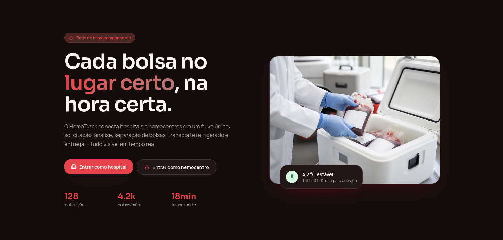

# HemoTrack - Plataforma de Distribuição de Hemocomponentes

> Projeto Integrador de Programação Orientada a Objetos (POO)  
> CESAR School · 3º Semestre · 2026.2


## O que é o HemoTrack?

Uma aplicação web que gerencia e distribui hemocomponentes (bolsas de sangue) entre hemocentros e hospitais. O sistema controla estoque, recebe requisições de hospitais, seleciona bolsas compatíveis (por tipo sanguíneo e validade), calcula rotas de entrega respeitando a cadeia fria, e monitora a temperatura durante o transporte.

## Tecnologias

| Camada | Stack |
|--------|-------|
| **Backend (API)** | Java 21, Spring Boot 4, Spring Security + JWT, H2 (dev) / Postgres (prod), OpenTelemetry (OTLP), Grafana Cloud |
| **Frontend (Interface)** | TypeScript, React 19, TanStack Router + TanStack Query, Vite, Tailwind CSS |
| **CI/CD** | GitHub Actions (build e testes) + Render (deploy automático) |
| **Versionamento** | Git/GitHub |
| **Docs** | Markdown |

## Entregas

### Entrega 01 — 31/08

Histórias de usuário definidas, protótipo Lo-Fi no Figma e screencast publicados. **Concluída.**
- [Protótipo Lo-Fi no Figma](https://www.figma.com/proto/o33X78ZoRifSqpQZyOuI2U/Hemotrack---Prototipo-LOFI?node-id=21-9&p=f&t=jxS6u0a4MgkJWZHt-1&scaling=min-zoom&content-scaling=fixed&page-id=0%3A1&starting-point-node-id=21%3A9)

- [Screencast navegando o protótipo (YouTube)](https://www.youtube.com/watch?v=_Mo2xrN9wh8)

### Entrega 02 — 21/09

Nesta entrega foram desenvolvidas as funcionalidades e os screencasts de criação de requisições e acompanhamento de status pelo hospital, no projeto HemoTrack, incluindo:

#### [Screencast atualizado do sistema (YouTube)](https://www.youtube.com/watch?v=YCow7kq3mf8)
[](https://www.youtube.com/watch?v=YCow7kq3mf8)

* HU03 — Criar requisição de hemocomponentes: o hospital informa componente, tipo sanguíneo, quantidade e prioridade, e o sistema registra a solicitação como "Pendente"
* HU04 — Visualizar e acompanhar requisições: o hospital vê a lista de suas próprias requisições, os detalhes de cada uma, e acompanha a mudança de status (por exemplo, de "Pendente" para "Aceita" quando o hemocentro aprova)

- 📄 [Documento com as histórias](https://github.com/miglitopictures/hemotrack/blob/main/docs/historias.md)


- Issue / Bug tracker:
  


### Entrega 03 — 19/10

Mais 2 histórias implementadas, commits semanais, novos screencasts e issue tracker atualizado.

### Entrega 04 — 09/11

Histórias restantes implementadas, versionamento contínuo, novos screencasts e issue tracker atualizado.


## Como rodar na sua máquina

### Pré-requisitos (instale antes de começar)

#### 1. Git
Pra clonar o repositório.

| SO | Como instalar |
|---|---|
| **Linux (Debian/Ubuntu)** | `sudo apt install git` |
| **Linux (Fedora)** | `sudo dnf install git` |
| **macOS** | `xcode-select --install` ou `brew install git` |
| **Windows** | `winget install Git.Git` ou [git-scm.com](https://git-scm.com) |

Confirme com: `git --version`

#### 2. JDK 21 ou superior
Pra rodar o backend Java.

| SO | Como instalar |
|---|---|
| **Linux (Debian/Ubuntu)** | `sudo apt install openjdk-21-jdk` |
| **Linux (Fedora)** | `sudo dnf install java-21-openjdk-devel` |
| **macOS** | `brew install openjdk@21` (depois `export PATH="/opt/homebrew/opt/openjdk@21/bin:$PATH"` no `~/.zshrc` ou `~/.bash_profile`) |
| **Windows** | `winget install EclipseAdoptium.Temurin.21.JDK` ou [adoptium.net](https://adoptium.net) |

Confirme com: `java -version` (deve aparecer 21 ou maior)

#### 3. Node.js 20.19+ e npm
Pra rodar o frontend React (o Vite 8 não roda em versões anteriores).

| SO | Como instalar |
|---|---|
| **Linux/macOS** | [nvm](https://github.com/nvm-sh/nvm): `nvm install --lts`, ou `brew install node` |
| **Windows** | `winget install OpenJS.NodeJS.LTS` ou [nodejs.org](https://nodejs.org) |

Confirme com: `node --version` e `npm --version`

---

### 1. Clone o repositório

```bash
git clone https://github.com/miglitopictures/hemotrack.git
cd hemotrack
```

### 2. Configure o `.env` do backend (obrigatório)

A aplicação **não sobe** sem um segredo para assinar os tokens de login.

```bash
cp backend/.env.example backend/.env
openssl rand -base64 48    # cole o resultado em JWT_SECRET
```

No mesmo arquivo, preencha também `ADMIN_EMAIL` e `ADMIN_SENHA`. São opcionais,
mas é esse usuário que aprova os cadastros — sem ele, nenhuma instituição
consegue operar.

O `.env` está no `.gitignore`: cada pessoa gera o seu.

### 3. Levante o Backend (terminal 1)

```bash
cd backend
./mvnw spring-boot:run    # macOS/Linux
mvnw.cmd spring-boot:run  # Windows
```

**Esperado:** `Started BackendApplication in X seconds`, e o backend em
`http://localhost:8080`. Deixe o terminal aberto.

### 4. Levante o Frontend (terminal 2)

```bash
cd frontend
npm install  # primeira vez só
npm run dev
```

**Esperado:** `Local: http://localhost:8081/`. Deixe o terminal aberto.

### 5. Crie uma conta e aprove

O sistema exige login, e toda instituição nova nasce pendente de aprovação.

1. Em `http://localhost:8081/cadastro`, cadastre um hospital ou hemocentro.
   Você entra automaticamente e cai na tela **Cadastro em análise**.
2. Numa janela anônima, entre em `/login` com o `ADMIN_EMAIL` e `ADMIN_SENHA`
   do seu `.env`. Você cai em **/admin** — clique em **Aprovar**.
3. Volte à primeira janela e clique em **Verificar novamente**. O painel abre.

Cadastre **um hospital e um hemocentro** para ver os dois lados do sistema.

### 6. Parar a aplicação

`Ctrl+C` em cada terminal.

> Guia detalhado, roteiro de testes da API e banco H2 em
> [`docs/como-rodar.md`](./docs/como-rodar.md).

---

## Estrutura do projeto

```
hemotrack/
├── backend/                    ← API REST em Java/Spring Boot
│   ├── src/main/java/         ← código-fonte
│   ├── pom.xml                ← dependências Maven
│   └── mvnw / mvnw.cmd        ← Maven (não instale, usa esse)
├── frontend/                   ← Interface em React/TypeScript/Vite (SPA)
│   ├── src/
│   ├── package.json           ← dependências npm
│   └── vite.config.ts         ← configuração do Vite
├── docs/                       ← Documentação
│   ├── como-rodar.md          ← guia completo de execução e testes
│   ├── historias.md           ← histórias de usuário (HU01-HU09)
│   ├── api/                   ← contrato da API e modelo de domínio
│   ├── deploy.md              ← CI/CD, Render e variáveis de ambiente
│   ├── telemetria.md          ← métricas via OpenTelemetry + Grafana Cloud
│   └── notas/                 ← notas de design
└── README.md                   ← você está aqui
```

---

## Histórias de Usuário (Funcionalidades)

| # | Descrição | Status |
|---|-----------|--------|
| HU01 | Cadastro e login de instituição | ✅ Pronto |
| HU02 | Gerenciar estoque de hemocomponentes | ⏳ Em progresso |
| HU03 | Criar requisição de sangue | ✅ Pronto |
| HU04 | Visualizar e acompanhar requisições | ✅ Pronto |
| HU05 | Aceitar ou recusar requisições | ✅ Pronto |
| HU06 | Selecionar bolsas compatíveis | ⏳ Em progresso |
| HU07 | Planejar rota de distribuição | ⏳ Em progresso |
| HU08 | Monitorar transporte em tempo real | ⏳ Em progresso |
| HU09 | Dashboard de indicadores | ⏳ Em progresso |

Ver detalhes completos em [`docs/historias.md`](./docs/historias.md).

---

## Dúvidas comuns

### A aplicação não abre no navegador
Confirme que:
- Backend está rodando (`Started BackendApplication` no terminal 1)
- Frontend está rodando (você vê `VITE v8.X.X ready in XXX ms` no terminal 2)
- Abra exatamente `http://localhost:8081/` (não é `localhost:8080`)
- Se ficar branco ou der erro 404, aguarde alguns segundos e recarregue (F5)

### Aparecem erros de CORS
O CORS está configurado no backend (`config/WebConfig.java`) para aceitar chamadas de `localhost:8081`. Se o frontend rodou em outra porta, o CORS bloqueia.

### Backend não sobe: `Could not resolve placeholder 'JWT_SECRET'`
Falta o `backend/.env`, ou ele está sem a variável. Volte ao passo 2 — a
aplicação não sobe sem um segredo para assinar os tokens.

### Não consigo aprovar nenhuma instituição
O usuário que aprova é criado na **primeira subida** em que `ADMIN_EMAIL` e
`ADMIN_SENHA` existam no `.env`. Procure no log da subida por
`ADMIN_SISTEMA criado para ...`. Se aparecer o aviso de que as variáveis não
foram configuradas, preencha e reinicie.

### Backend não compila
Confirme que:
- `java -version` mostra 21 ou maior
- Você está dentro da pasta `backend/` quando roda `./mvnw spring-boot:run`
- Primeira execução demora (baixa dependências da internet)

### "mvnw: Permission denied" (macOS/Linux)
Rode:
```bash
chmod +x mvnw
./mvnw spring-boot:run
```

### Frontend não instala dependências
Se `npm install` der erro:
```bash
rm -rf node_modules package-lock.json
npm install
```

### Frontend fica branco ou não carrega
O Vite leva alguns segundos no build inicial. Aguarde e recarregue (F5). Se continuar branco, abra o DevTools (F12) e veja a aba Console.

### Caí no login e não consigo entrar em nenhum painel
É o comportamento esperado: `/hospital` e `/hemocentro` exigem sessão, e a instituição precisa estar aprovada. Siga o passo 5 do guia acima.

---

## Testando a API

Use **Insomnia** ou **Postman** (o processo é o mesmo) ou **`curl`**. Só
`POST /auth/login` e `POST /instituicoes` são públicas; o resto responde `401`
sem token.

**1. Obtenha um token:**

```bash
curl -X POST http://localhost:8080/auth/login \
  -H "Content-Type: application/json" \
  -d '{"email": "seu@email.com", "senha": "suasenha"}'
```

Resposta: `{ "token": "eyJ...", "expiraEm": "..." }`.

**2. Mande o token nas demais chamadas.** No Insomnia/Postman, aba
**Auth**/**Authorization** → **Bearer Token**. No `curl`:

```bash
curl http://localhost:8080/auth/me -H "Authorization: Bearer eyJ..."
```

O token vale 8 horas. Os erros saem em `application/problem+json`, com `type`,
`title` e `detail` — a lista completa está no
[contrato da API](./docs/api/contrato-api.md).

O roteiro completo (cadastro → login → bloqueio → aprovação, com o status
esperado de cada chamada) e a configuração passo a passo do Insomnia/Postman
estão em [`docs/como-rodar.md`](./docs/como-rodar.md#6-testar-a-api).

---

## Desenvolvido por

| Nome completo | E-mail (CESAR School) | Papel |
|---|---|---|
| Lucas Bonfim Gomes | lbg2@cesar.school | Integrante |
| Lucas Moreira de Carvalho | lmc4@cesar.school | Integrante |
| Lucas Guilherme Pinheiro Valença Barbosa  | lgpvb@cesar.school | Integrante |
| Raysa Costa Queiroz | rcq@cesar.school | Integrante |
| Rodrigo Morais Silvestri de Castro Montenegro | rmscm@cesar.school | Integrante |
| Pablo Tamborini Nogueira | ptn@cesar.school | Líder Técnico |
| Miguel Duarte de Barros | mdb@cesar.school | Integrante |
| Gabriel Cavalcante Barros de Oliveira  | gcbo@cesar.school | Integrante |
---

## Próximas etapas

- Implementar HU02 (estoque real)
- Conectar HU06 (seleção de bolsas compatíveis)
- Implementar algoritmo de rota (HU07)
- Dashboard de indicadores (HU09)

Para detalhes de cada história, ver [`docs/historias.md`](./docs/historias.md).
