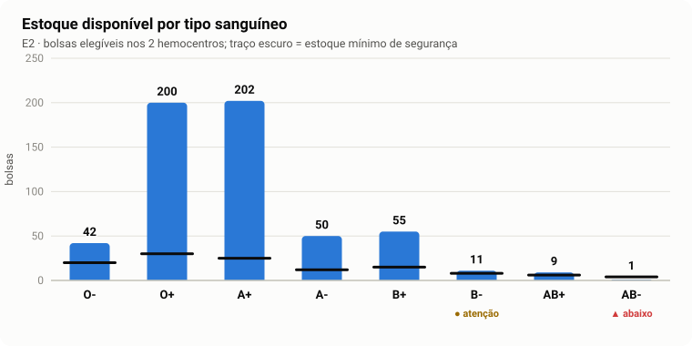
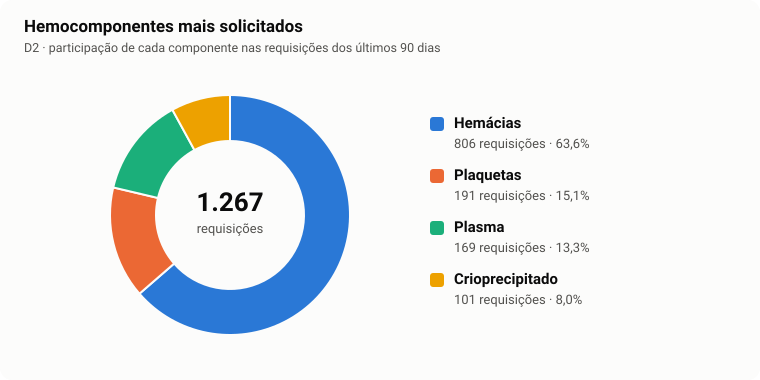
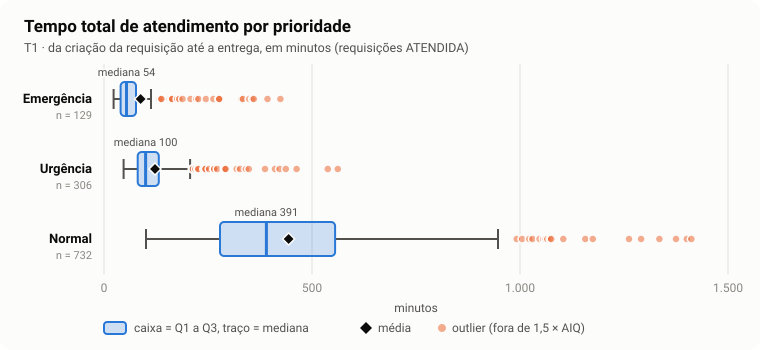
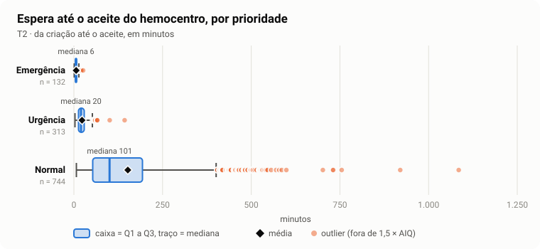
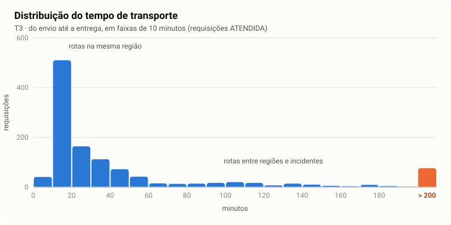
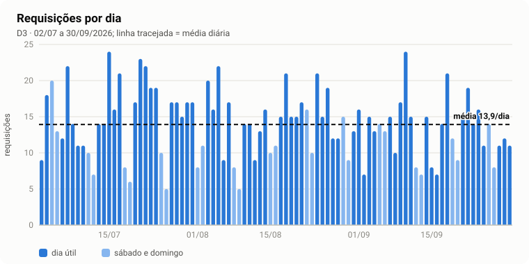
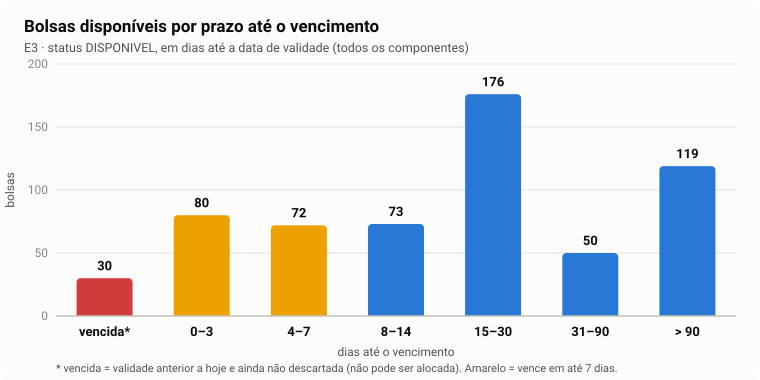

# HemoTrack — Relatório de Estatística, Unidade 1

- **Disciplina:** Estatística e Probabilidade (EST). **Projeto Integrador:** PI2-E6. **Épico:** PI2-3.
- **Tarefa:** PI2-109, interpretação analítica para o relatório final de EST da Unidade 1.
- **Base:** massa sintética de `estatistica/dados/`, com 1.267 requisições, 3.910 bolsas e 12.626 leituras de telemetria de 02/07 a 30/09/2026. O estoque é uma fotografia de 30/09/2026 às 15h.

> Todos os números deste relatório vêm de [`medidas-descritivas.md`](./medidas-descritivas.md) (PI2-107) e do [painel de indicadores](./painel-indicadores.html) (PI2-108). A definição de cada indicador (E1 a T4) está em [`indicadores.md`](./indicadores.md) (PI2-105).

---

## 1. Objetivo

Interpretar as medidas descritivas calculadas sobre a operação simulada da rede de sangue e traduzi-las em decisões de gestão. O foco está em três perguntas:

1. **Média ou mediana?** Qual medida descreve melhor o tempo de atendimento, já que os dados têm outliers.
2. **Quão previsível é a operação?** Leitura do coeficiente de variação (CV).
3. **Onde estão os riscos?** Desabastecimento de tipos sanguíneos raros e perda de bolsas por vencimento.

## 2. Método

- **Dados:** são 100% sintéticos, por exigência da LGPD. O gerador (`GeradorDadosEst.java`) usa semente fixa, então os resultados são reprodutíveis. As premissas da simulação estão em [`dados-sinteticos.md`](./dados-sinteticos.md).
- **Medidas:**
  - média, mediana e moda;
  - amplitude, variância amostral (divisor *n − 1*), desvio padrão e CV = desvio padrão ÷ média;
  - quartis por interpolação linear, o mesmo método de `QUARTIL.INC` no Excel;
  - outliers pelo critério do boxplot, ou seja, valores fora de [Q1 − 1,5·AIQ ; Q3 + 1,5·AIQ].
- **Leitura do CV:** usamos a faixa didática usual: até 15% é baixa dispersão, de 15% a 30% é média e acima de 30% é alta. É uma convenção de referência, não uma regra universal. O CV só faz sentido em escala de razão, com zero absoluto. Por isso **não** foi usado para temperatura em °C (seção 5.4).

## 3. Visão geral: painel de indicadores

| Indicador | Valor | Leitura |
|---|---:|---|
| Bolsas disponíveis (E1) | 570 | estoque elegível nos 2 hemocentros |
| Requisições entregues no período (D1) | 1.167 | 92,3% das requisições finalizadas (D4) |
| Requisições recusadas (D4) | 64 | taxa de recusa de 5,1% |
| Bolsas que vencem em até 7 dias (E3) | 152 | 26,7% do estoque disponível |
| Taxa de descarte (E4) | 7,7% | 300 de 3.910 bolsas do período |
| Transportes com alerta térmico (T4) | 3,5% | 41 de 1.167 transportes |

A demanda é dominada por **hemácias** (63,6% das requisições), seguidas de plaquetas (15,1%), plasma (13,3%) e crioprecipitado (8,0%). Qualquer ruptura no estoque de hemácias afeta a maior parte dos atendimentos.

---

## 4. Média × mediana no tempo de atendimento

| Tempo total de atendimento (min) | n | Média | Mediana | Média ÷ mediana | Desvio padrão | CV | Outliers |
|---|---:|---:|---:|---:|---:|---:|---:|
| Geral | 1.167 | 320,3 | 274,0 | 1,17 | 244,2 | 76,2% | 21 (1,8%) |
| Emergência | 129 | 88,1 | 54,0 | **1,63** | 87,5 | **99,4%** | **24 (18,6%)** |
| Urgência | 306 | 122,7 | 100,0 | 1,23 | 74,0 | 60,3% | 26 (8,5%) |
| Normal | 732 | 443,8 | 390,5 | 1,14 | 224,3 | 50,6% | 21 (2,9%) |

**A média é sempre maior que a mediana, e isso mostra uma distribuição assimétrica à direita.** A maioria das requisições é atendida num tempo "típico", mas um grupo menor demora muito mais. Esses casos longos puxam a média para cima, enquanto a mediana não muda: ela depende só da posição do valor central, não do tamanho dos extremos.

O efeito é mais forte na **emergência**. A média de 88 min é 63% maior que a mediana de 54 min. Metade das emergências é entregue em até 54 min, e 75% em até 77 min (Q3). Mas 24 casos (18,6%) passam do limite de outlier de 132,5 min, chegando a 424 min. Destes, **19 são rotas acima de 60 km**, ou seja, atendimentos feitos por um hemocentro de outra região. Considerando só as emergências em rotas de até 60 km (n = 108), a mediana é 49,5 min e a média é 56,5 min. Com o caso típico isolado, média e mediana praticamente se encontram.

**Implicações para a gestão:**

- **Para o tempo típico, use a mediana.** Reportar "a emergência leva em média 88 min" passa uma impressão pior do que o caso normal e esconde onde está o problema.
- **Para metas, use quartis ou percentis.** Um exemplo é "75% das emergências em até 77 min". A média sozinha não mostra a cauda.
- **Os outliers não são erro de medida:** são o sinal operacional mais importante. O atraso da emergência está concentrado em **rotas entre regiões**. A decisão é de roteirização: qual hemocentro atende qual hospital (ver o grafo/Dijkstra de AED).

Na **espera até o aceite**, a prioridade NORMAL tem média de 152 min e mediana de 100,5 min, com CV de 94,4% e 61 outliers. Desses outliers, **38 são pedidos feitos de madrugada (22h às 6h)** que esperaram o turno da manhã. A fila noturna é a principal causa da assimetria nessa etapa. Emergência (mediana 6 min) e urgência (mediana 20 min) são aceitas rapidamente.

---

## 5. Coeficiente de variação: previsibilidade da operação

| Variável | Média | Desvio padrão | CV | Previsibilidade |
|---|---:|---:|---:|---|
| Tempo de transporte (min) | 51,1 | 74,2 | **145,1%** | muito baixa |
| Tempo total, emergência (min) | 88,1 | 87,5 | 99,4% | baixa |
| Espera até aceite, normal (min) | 152,0 | 143,4 | 94,4% | baixa |
| Tempo total, geral (min) | 320,3 | 244,2 | 76,2% | baixa |
| Bolsas por requisição | 2,6 | 1,5 | 58,0% | baixa |
| Bolsas solicitadas por dia | 36,0 | 13,5 | 37,5% | moderada a baixa |
| Requisições por dia | 13,9 | 4,6 | 33,0% | moderada |
| Estoque disponível entre os 8 tipos | 71,3 | 82,5 | 115,8% | muito desigual |

### 5.1 Distribuição (tempos): previsibilidade baixa

Todos os tempos têm CV acima de 30%. **O processo de distribuição é pouco previsível.** O pior caso é o **transporte, com CV de 145%**, e o histograma explica por quê:

A distribuição é **bimodal**. A maioria das viagens (rotas locais) fica entre 10 e 30 min, e um segundo grupo, de rotas intermunicipais e incidentes, passa de 200 min. Dos 178 outliers de transporte, 153 são rotas acima de 60 km. Quando dois processos diferentes são misturados num mesmo indicador, o CV fica muito alto e a média (51 min) não representa nenhum dos dois grupos. **A recomendação é separar o indicador por tipo de rota.** Só nas rotas de até 60 km, a mediana é 18 min e a média 26,2 min.

### 5.2 Demanda: variabilidade moderada

A demanda diária tem média de 13,9 requisições e mediana de 14, praticamente iguais, o que indica uma distribuição simétrica, sem outliers. O CV é de 33%: existe variação, sobretudo pelo efeito de fim de semana (barras mais claras), mas ela é regular e **planejável**. Na prática, o estoque de segurança pode ser dimensionado como demanda média + *k* desvios padrão (para bolsas: 36 ± 13,5 por dia).

### 5.3 Estoque: muito desbalanceado entre tipos

O CV de 115,8% entre os 8 tipos sanguíneos reflete a própria distribuição ABO/Rh da população: O+ e A+ concentram o estoque. Por isso, **a média de 71 bolsas por tipo não descreve nenhum tipo real**. O controle precisa ser feito tipo a tipo, como mostra a seção 6.1.

### 5.4 Temperatura: desvio padrão, não CV

Para temperatura em °C, o CV não tem sentido: o zero da escala Celsius é arbitrário, e plasma e crioprecipitado têm média negativa. Por isso a dispersão foi medida pelo **desvio padrão**: 0,75 °C nas hemácias (média de 4,05 °C, faixa de 2 a 6 °C) e 0,77 °C nas plaquetas. O processo térmico é estável. As 149 leituras fora da faixa (1,2%) vêm de 41 transportes (3,5%) com excursão pontual, e aparecem como outliers na tabela de medidas descritivas (cadeia fria).

---

## 6. Riscos operacionais

### 6.1 Desabastecimento de tipos raros

| Tipo | Disponíveis | Mínimo | Cobertura do mínimo | Dias de cobertura* | Taxa de recusa |
|---|---:|---:|---:|---:|---:|
| O− | 42 | 20 | 210% | 13,2 | **14,0%** |
| B− | 11 | 8 | 138% | 12,7 | **13,3%** |
| AB+ | 9 | 6 | 150% | **8,8** | 2,6% |
| AB− | **1** | 4 | **25%** | 15,2 | 0,0% (n = 4) |
| O+ | 200 | 30 | 667% | 15,7 | 4,6% |
| A+ | 202 | 25 | 808% | 15,8 | 2,6% |

\* Dias de cobertura = bolsas disponíveis ÷ média de bolsas pedidas por dia daquele tipo nos 90 dias.

- **AB− está abaixo do mínimo de segurança** (1 bolsa contra um mínimo de 4). A demanda de AB− é muito pequena (4 requisições em 90 dias), então os dias de cobertura parecem confortáveis. Esse é o risco típico de tipo raro: **a média de consumo é baixa, mas um único pedido pode zerar o estoque.** Para tipos raros, o mínimo absoluto deve prevalecer sobre a cobertura em dias.
- **O− e B− têm as maiores taxas de recusa** (14,0% e 13,3%, contra 2% a 5% nos tipos positivos), mesmo acima do mínimo. O O− merece atenção especial por ser o doador universal de hemácias: é pedido também em emergências sem tipagem. **Recomendação:** campanha de doação dirigida a O−, B− e AB− e remanejamento entre os dois hemocentros antes de recusar.
- **AB+ tem a menor cobertura em dias (8,8).** Está acima do mínimo, mas é o primeiro tipo a cair abaixo dele se a demanda subir.

### 6.2 Perda por vencimento

- **152 bolsas (26,7% do estoque disponível) vencem em até 7 dias.** Dessas, 80 são **plaquetas**: a validade de 5 dias faz com que *todo* o estoque de plaquetas esteja sempre nessa faixa (mediana de 3 dias até vencer). As outras 72 são hemácias, 19,4% do estoque de hemácias (mediana de 19 dias até vencer).
- **30 bolsas já vencidas continuam com status DISPONIVEL.** Elas não podem ser alocadas, mas ocupam espaço e inflam o estoque aparente se a regra de elegibilidade não for aplicada. **Recomendação:** rotina diária de descarte.
- **A taxa de descarte é de 7,7%** (300 bolsas), e 64% delas (191) são hemácias.
- **Recomendações:**
  - aplicar o **FEFO** (primeiro a vencer, primeiro a sair) na alocação, que é exatamente a fila de prioridade do módulo de AED;
  - usar o card "vencem em 7 dias" como gatilho para oferecer essas bolsas a outros hospitais;
  - para plaquetas, programar a coleta pela demanda diária (média de 2,1 requisições de plaquetas por dia), não por estoque.

### 6.3 Cadeia fria

Com 3,5% dos transportes registrando excursão térmica, cerca de 1 em cada 28 entregas precisa de avaliação da bolsa antes do uso. O indicador T4 deve disparar alerta em tempo real (HU08) e alimentar a taxa de descarte.

---

## 7. Conclusões

1. **Os tempos de atendimento são assimétricos à direita,** com média sempre maior que a mediana. A mediana e os quartis são as medidas adequadas para comunicar e fixar metas. A média deve vir sempre acompanhada da mediana.
2. **O processo de distribuição tem baixa previsibilidade** (CV de 50% a 145% nos tempos). A causa principal não é aleatória: é a **mistura de rotas locais e intermunicipais**. Separar o indicador por tipo de rota e revisar qual hemocentro atende cada hospital reduz tanto o CV quanto os outliers da emergência.
3. **A demanda é regular e planejável** (CV de 33%, simétrica e sem outliers), o que permite dimensionar o estoque de segurança com média e desvio padrão.
4. **O risco de desabastecimento está nos tipos negativos raros.** AB− já está abaixo do mínimo, e O− e B− concentram as recusas.
5. **O risco de perda está nas plaquetas** (validade curta) e nas bolsas vencidas não descartadas. FEFO e descarte diário são as respostas diretas.

## 8. Limitações

- **Os dados são sintéticos.** Os padrões encontrados (assimetria, fila noturna, rotas intermunicipais, falta de negativos) refletem as premissas do gerador, escolhidas para serem plausíveis, e **não constituem evidência sobre uma rede real**. O que se transfere para a operação real é o **método**: os indicadores, as medidas e a forma de interpretar.
- **Estoque e status são uma fotografia** de 30/09/2026 às 15h. Por isso há poucas requisições em aberto (1 pendente, 1 em separação, nenhuma em transporte).
- **O estoque mínimo por tipo** é a tabela de referência do frontend (`minimoPorTipo`), não uma norma técnica.
- **A análise é descritiva.** Intervalos de confiança, testes de hipótese e modelos de probabilidade ficam para a Unidade 2.

---

*Gráficos gerados por `estatistica/PainelIndicadores.java` e medidas por `estatistica/AnaliseDescritiva.java`. Para reproduzir, rode a partir da raiz do repositório: `java estatistica/GeradorDadosEst.java`, depois `java estatistica/AnaliseDescritiva.java` e por fim `java estatistica/PainelIndicadores.java`.*
